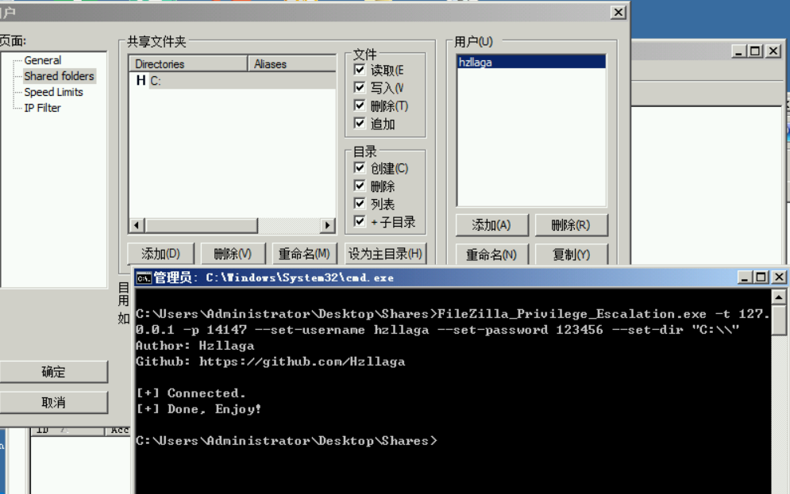

# FileZilla Privilege Escalation Tool

有些服务器可能端口转发会拦截，写了一个小工具可以在webshell下直接添加FTP用户。


```
❯ .\FileZilla_Privilege_Escalation.exe --help
Author: Hzllaga
Github: https://github.com/Hzllaga

FileZilla_Privilege_Escalation 1.0.0.0
Copyright c  2021

  -t, --target      Required. FileZilla Server Interface IP.

  -p, --port        Required. FileZilla Server Interface port.

  --password        FileZilla Server Interface password.

  --set-username    Required. FTP username which you want to create.

  --set-password    Required. FTP password which you want to create.

  --set-dir         Required. FTP user home dir(e.g. C:\).

  --help            Display this help screen.

  --version         Display version information.
```


